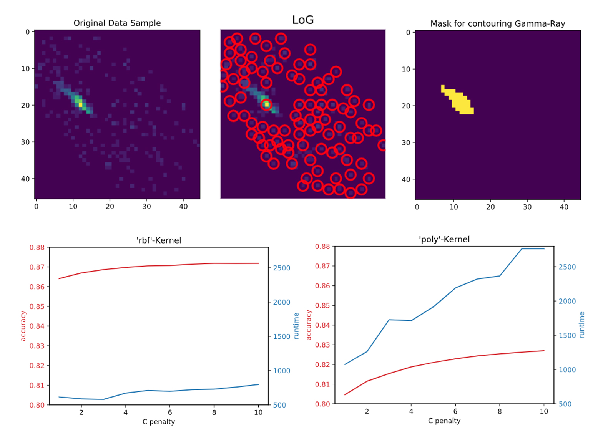

# Fachprojekt Data Mining and Data Analysis

Code for an undergraduate data mining and data analysis project on Gamma-Hydron Separation at TU Dortmund University.



In the project, we discuss different approaches to tell apart gamma-rays from other particles of the universe, which is known as 'Gamma-Hydron Separation'. In order to do so, we extract different features from a given set of particle observations, which could potentially characterize gamma-rays. Afterwards, we use different classifier-algorithms in order to distinguish those gamma-rays from non-relevant observations.  

The following code contains basic library imports and loads the sample data, aswell as the test data and their extracted feature sets. In addition, 10 random data samples are shown; a data sample is provided as a two dimensional array, so each value can be interpreted as a pixel. Especially as it comes to the feature extraction, we think it is way easier to think of the samples as pictures with pixels rather than pure arrays with individual array values.  

As it comes to the plots for different hyperparameter-configurations of the classifiers, we already precomputed inital results by executing the given code in advance. If the values are supposed to be computated again, the given array allocations have to be deleted (or marked as a comment).

__Unfortunatly we cannot provide the original data.__

Some of the results:

```
rf classifier
-------------------------------------
[[22181  2811]
 [ 4137 20871]]
              precision    recall  f1-score   support

           0       0.84      0.89      0.86     24992
           1       0.88      0.83      0.86     25008

    accuracy                           0.86     50000
   macro avg       0.86      0.86      0.86     50000
weighted avg       0.86      0.86      0.86     50000

-------------------------------------
```
```
mlp classifier
-------------------------------------
[[23071  1921]
 [ 4412 20596]]
              precision    recall  f1-score   support

           0       0.84      0.92      0.88     24992
           1       0.91      0.82      0.87     25008

    accuracy                           0.87     50000
   macro avg       0.88      0.87      0.87     50000
weighted avg       0.88      0.87      0.87     50000

-------------------------------------
```
```
SVM classifier
-------------------------------------
[[23086  1906]
 [ 4483 20525]]
              precision    recall  f1-score   support

           0       0.84      0.92      0.88     24992
           1       0.92      0.82      0.87     25008

    accuracy                           0.87     50000
   macro avg       0.88      0.87      0.87     50000
weighted avg       0.88      0.87      0.87     50000

-------------------------------------
```
